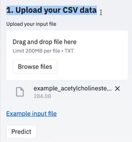

# Training-drug-discovery-02

## Project Description: Software Engineer Trainee in Drug Discovery

#### Project Title: Intelligent Drug Discovery Platform

#### Overview:

As a Software Engineer Trainee, you will contribute to the development of an Intelligent Drug Discovery Platform leveraging state-of-the-art ML/DL technologies and cloud services such as Azure DevOps and AWS. This project aims to streamline and enhance drug discovery processes, providing insights that can accelerate the identification and development of new therapeutic compounds.

#### Objectives:

- Develop a robust platform for drug discovery that integrates AI-driven insights with traditional methodologies.

- Utilize ML/DL models to analyze drug information and extract relevant information on the drug candidates.

- Implement data processing and storage solutions using AWS services, including but not limited to Lambda, EC2 and DynamoDB.

- Collaborate on front-end development using React.js to create an intuitive user interface for researchers and scientists.

#### Technologies and Tools:

- **AI & Machine Learning:** Scikit-learn,XGBoost,Pytorch,Tensorflow preferred but no restrictions.

- **Cloud Services:** AWS (Lambda, EC2, DynamoDB), Azure DevOps

- **Programming Languages:** Python for backend development, React.js for frontend development

- **Data Management:** Use of cloud databases and search services to manage large datasets related to drug compounds and clinical trials.

#### Key Responsibilities:

1. **Data Cleaning and EDA:**

- Perform Exploratory Data Analysis on provided data.

- Gather insights from the data and perform data cleaning & imputation if required.

2. **ML/DL Model development:**
- Train models based on specific drug discovery tasks.
- Deploy the best suitable model for the use-case.

3. **Backend Development:**

- Build and maintain RESTful APIs using Python to facilitate communication between the front end and the database.

- Utilize AWS DynamoDB for scalable data storage solutions.

4. **Frontend Development:**

- Develop user interfaces with React.js that allow users to interact with the platform, visualize data, and generate reports.

- Ensure responsive design and user-friendly navigation.

5. **Collaboration and Deployment:**

- Work with cross-functional teams to ensure seamless integration of components.

- Use Azure DevOps for continuous integration and deployment practices, ensuring code quality and version control.

#### Required Datasets:
- Dataset and it's description will be provided.

#### Learning Outcomes:

- Gain hands-on experience with AI technologies and their applications in drug discovery.

- Develop practical skills in cloud computing, data processing, and web development.

- Understand the drug discovery process and how technology can innovate and improve research outcomes.

#### Dependencies:

- Familiarity with Python and JavaScript/React.js is essential.

- Basic knowledge of cloud services (AWS or Azure) and version control systems (Git).

- Interest in pharmaceuticals and a willingness to learn about the drug discovery landscape.

This project will not only enhance your technical skills but also provide valuable exposure to the drug discovery industry, enabling you to contribute to meaningful advancements in healthcare.

## Problem Statement: Intelligent Drug Discovery Insights Extraction

#### Overview:
The goal is to develop a system that utilizes ML/DL models to extract relevant insights from the provided data related to drug candidates. The system will take input in the form of drug candidate information data and output key insights such as:-
1. Drug potency (pIC50 value)
2. Model explainability:- Which of the drug properties (features) had the most impact on the prediction.

#### Input:
1. **Drug Candidate Information:** A csv file containing details about a drug candidate.

    This dataset consists of 2 different files for a potential drug against the COVID-19 virus. The original file consists of only a SMILES notation and pIC50 constant against the COVID-19 virus for a chemical compound. The second one consists of engineered features using the pubchempy library of Python. This library helps to access the PubChem data. PubChem is a database of millions of chemical compounds. We used this library to fetch the properties of the compounds using their SMILES representation.
    
    The dataset is made publically available by the Government of India as a part of their Drug Discovery Hackathon. There are some potential drugs against the COVID-19 virus in this dataset as suggested by the hackathon organisers.
    
    ##### Column information:-
    - CID: Compound ID
    - SMILES: SMILES notation of the compound
    - MolecularFormula: Molecular Formula of the compound
    - MolecularWeight: Molecular weight of the compound
    - InChI: InChI representation of the compound
    - InChIKey: InChI ID
    - UPACName: IUPAC Name of the compound
    The rest of the columns are chemical features extracted using the `pubchempy` library.

#### Expected Output:
The output will be a structured prediction csv file containing extracted insights, such as:
- plc50 values
- Feature importance values

#### Input Examples:

1. **CSV data input:**

|CID    |SMILES                                                             |MolecularFormula|
|-------|-------------------------------------------------------------------|----------------|
|2744814|ClC1=CC(NC(=O)CSC2=NC=CC(=N2)C2=CSC(=N2)C2=CC=CC=C2)=CC(Cl)=C1     |C21H14Cl2N4OS2  |
|2821293|CN1N=C(C=C1C(F)(F)F)C1=CC=C(S1)C1=CC=NC(SCC(=O)NC2=CC=C(Cl)C=C2)=N1|C21H15ClF3N5OS2 |
|2820912|CSC1=C(C(C)=C(S1)C1=NC(C)=CS1)C1=CC=NC(SCC(=O)NC2=CC=C(Cl)C=C2)=N1 |C22H19ClN4OS4   |


  
#### Expected Output Examples:
1. **Prediction CSV data input:**

|CID    |SMILES                                                             |MolecularFormula|pIC50       |
|-------|-------------------------------------------------------------------|----------------|------------|
|2744814|ClC1=CC(NC(=O)CSC2=NC=CC(=N2)C2=CSC(=N2)C2=CC=CC=C2)=CC(Cl)=C1     |C21H14Cl2N4OS2  |-0.477121255|
|2821293|CN1N=C(C=C1C(F)(F)F)C1=CC=C(S1)C1=CC=NC(SCC(=O)NC2=CC=C(Cl)C=C2)=N1|C21H15ClF3N5OS2 |-1          |
|2820912|CSC1=C(C(C)=C(S1)C1=NC(C)=CS1)C1=CC=NC(SCC(=O)NC2=CC=C(Cl)C=C2)=N1 |C22H19ClN4OS4   |-1.041392685|

### Summary:
This system will provide researchers with an efficient way to gather and analyze critical information facilitating informed decision-making in the drug discovery process.

## Database Structure, Pipeline Description, and Architecture

#### Database Structure

The database will be designed to store and manage data related to drug candidates, research papers, clinical trials, and extracted insights. The following schema outlines the key tables and their relationships.

##### 1. **Tables**

- **DrugCandidates (INPUT)**
  - `CID` (Primary Key, UUID)
  - `SMILES` (String)
  - Add all columns in the csv file to the Database
  - `created_at` (Timestamp)
  - `updated_at` (Timestamp)
- **PredictedDrugCandidates (OUTPUT)**
  - `CID` (Primary Key, UUID)
  - `plC50` (Float)
  - Create columns having Feature Importance for each column of the input data.
  - `created_at` (Timestamp)
  - `updated_at` (Timestamp)
---

#### Pipeline Description

The data pipeline will involve multiple stages for ingesting, processing, and storing data. Here's a high-level overview of the steps involved:

1. **Data Processing**
   - **Process**: Use data prepoccesing to transform the data into a suitable format for storage.
   - **Data Validation**: Ensure data integrity and consistency during transformation.

3. **Storage**
   - Store processed data in respective tables (DrugCandidates, PredictedDrugCandidates) in a relational database or a NoSQL database like DynamoDB.

4. **API Development**
   - Build RESTful APIs using Python to provide access to stored data and insights for front-end applications.

5. **Frontend Integration**
   - Use React.js to create a user interface that allows researchers to query the database and visualize insights.
   - Some ideas for the frontend design:-
     
   

6. **Continuous Monitoring and Updating**
   - Implement logging and monitoring to track data ingestion and processing performance.
   - Schedule regular updates to refresh the database with new research and clinical trial data.

---

#### Architecture

The architecture consists of several layers, including data sources, processing units, storage, and user interfaces.

##### 1. **Architecture Diagram** (Text Representation)

```
+-------------------+             +-------------------+
|                   |   Ingest    |                   |
|   Input csv file  +------------>+   Data Processing |
|                   |             |                   |
+-------------------+             +-------------------+
                                            |
                                            |
                                            v
                                  +-------------------+
                                  |                   |                                  
                                  | Modelling and     |
                                  | Feature Importance|
                                  |                   |
                                  +-------------------+
                                            |
                                            |                                            
                                            v
                                  +-------------------+
                                  |                   |
                                  |   Data Storage    |
                                  | (Relational/NoSQL)|
                                  |                   |                                  
                                  +-------------------+
                                            |
                                            |                                            
                                            v
                                  +-------------------+
                                  |                   |
                                  |        APIs       |
                                  |                   |
                                  +-------------------+
                                            |
                                            |
                                            v
                                  +-------------------+
                                  |                   |
                                  | React.js Frontend |
                                  |                   |
                                  +-------------------+
```

##### 2. **Key Components**
- **Data Processing**: Pandas, Numpy etc for data preprocessing.
- **Modelling**: Scikit-learn, XGBoost, Pytorch etc for modelling.
- **Storage**: AWS DynamoDB for NoSQL or PostgreSQL for relational data.
- **APIs**: Python Flask or FastAPI for backend development.
- **Frontend**: React.js for building the user interface.

---

This architecture and pipeline will facilitate efficient data management and insightful analysis in the drug discovery process, making it easier for researchers to derive meaningful conclusions from complex datasets.
